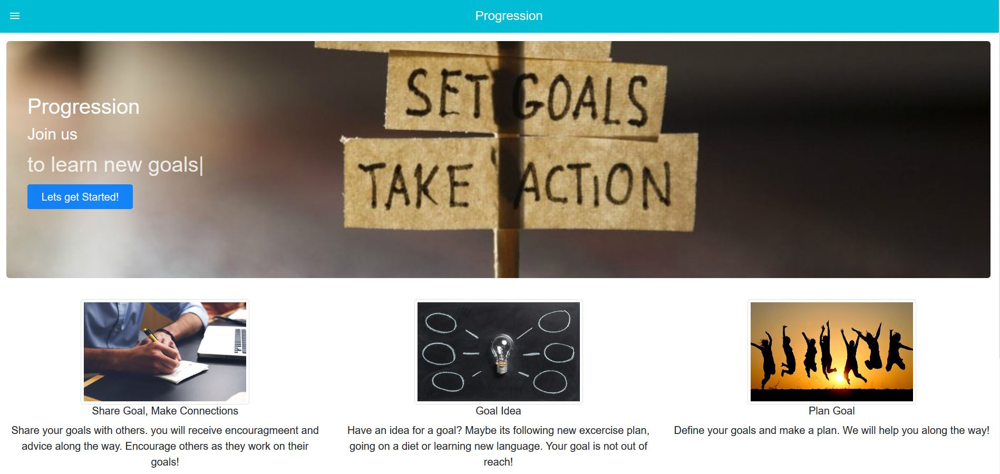
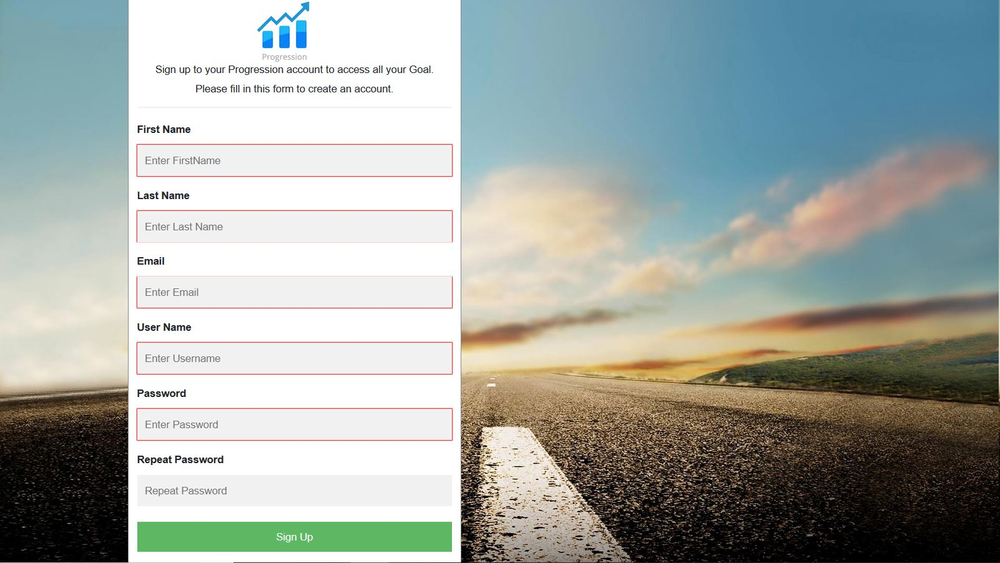
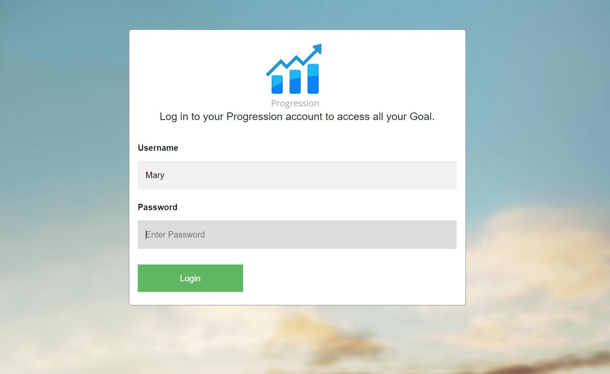
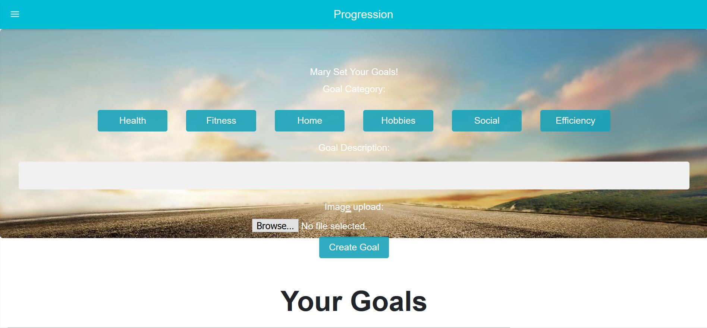
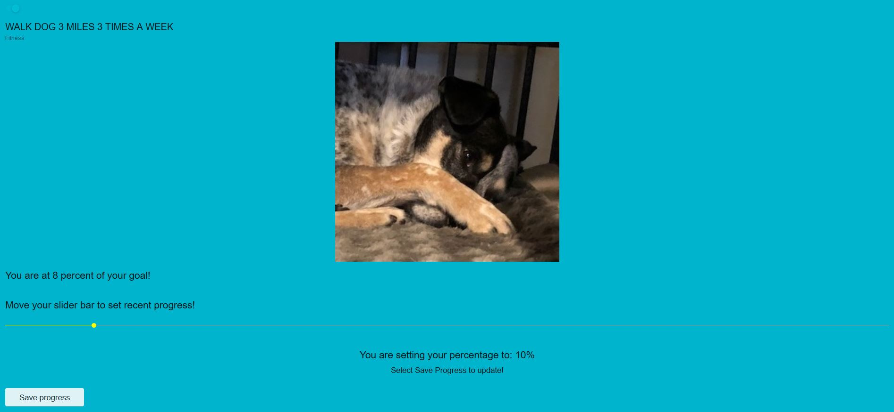
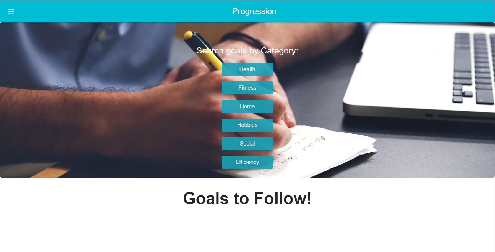
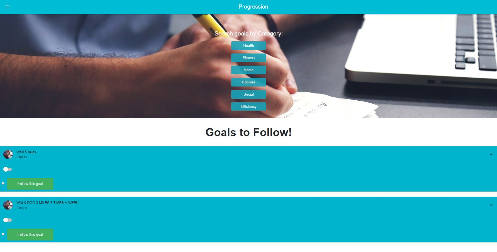
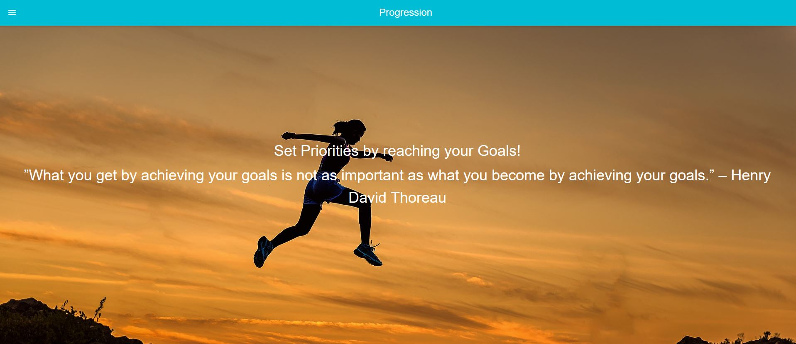

# Progression
Progression is full MERN Stack app that helps users to set their goals, and find other peoples goal.

## Technology
-HTML
-CSS
-Bootstrap
-Javascript
-Axios
-Bcrypt
-MongoDB
-Mongoose
-NODE.js
-Express.js
-Material-UI
-AWS S3

#####  Main Progression screen


##### Progression Signup screen


##### Progression Login


##### Progression User Home



##### Progression Search Goals



##### Progression About Page


##Local deployment
1. clone the folder
2. yarn install on client folder
3. yarn install on root folder
4. yarn start


## Starting the app locally

Start by installing front and backend dependencies. While in this directory, run the following commands:

```
yarn install
cd client
yarn install
cd ..
``

After both installations complete, run the following command
```
yarn start
```

That's it, your app should be running on <http://localhost:3000>. The Express server should intercept any AJAX requests from the client.

## Deployment (Heroku)

After confirming that you have an up to date git repository and a Heroku app created, complete the following:

1. Build the React app for production by running the following command:

```
yarn build
```

2. Add and commit all changes to git

3. Push to Heroku

If all previous steps were followed correctly, your application should be deployed to Heroku! in your terminal:

